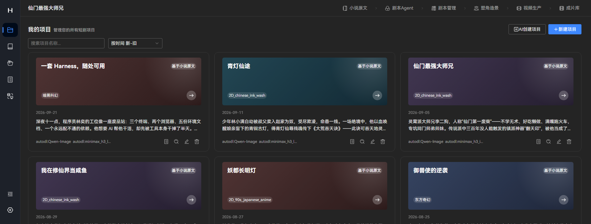
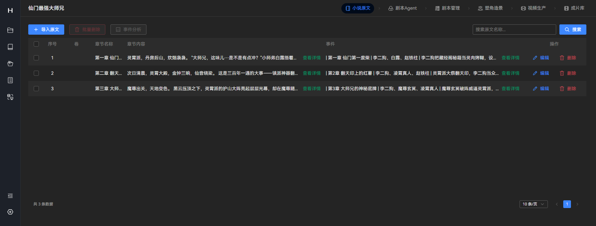
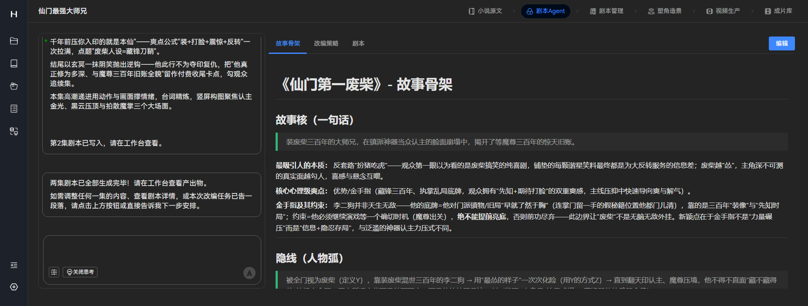
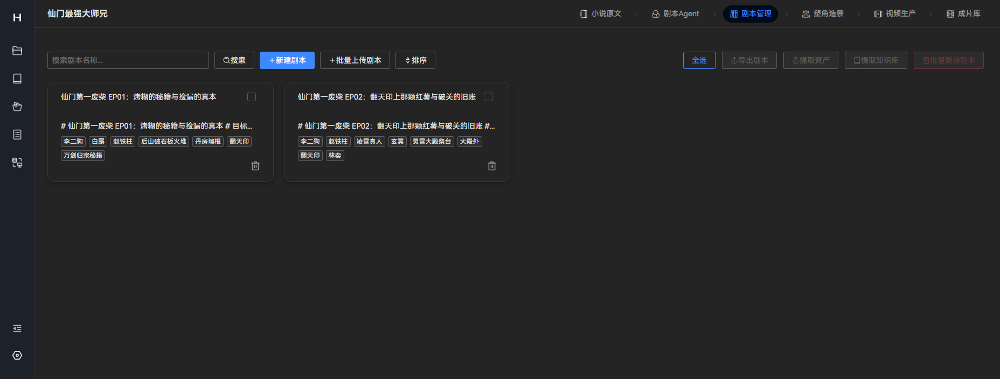
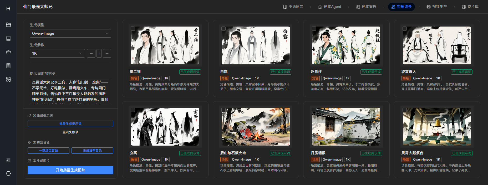
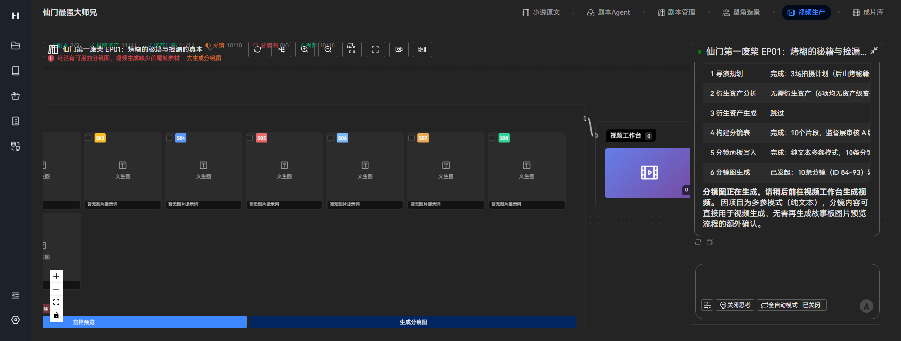
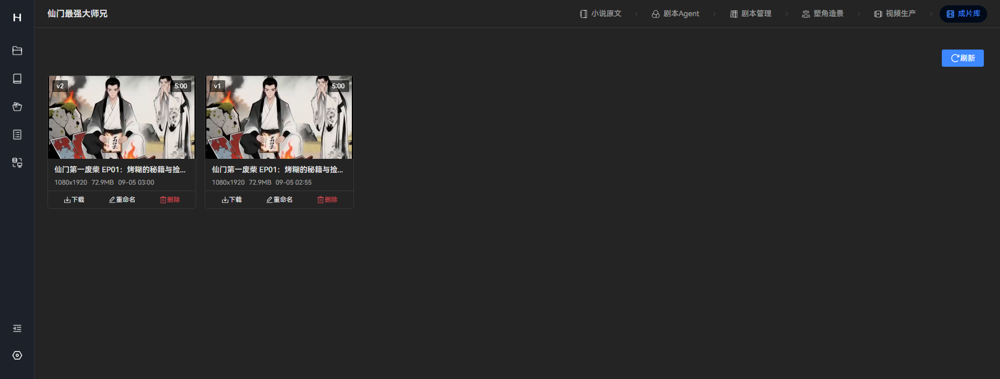

# Hopeflow

> AI 短剧漫剧工厂 —— 从小说到视频，一站式 AI 全流程短剧创作平台

**Apache-2.0 许可** · Vue 3.5 · TypeScript 5.x · Express 5 · Electron 40 · SQLite

Hopeflow 利用 AI 技术将小说自动转化为剧本，结合 AI 生成的图片和视频，实现高效的短剧创作。项目采用前后端分离架构，支持桌面客户端和 Web 部署两种模式。

## 演示

一条完整的生产链路：**小说原文 → 剧本 Agent → 剧本管理 → 塑角造景 → 视频生产 → 成片库**。

https://github.com/CodeMan-cmd/Hopeflow/raw/master/docs/screenshots/hopeflow-demo.mp4

> 演示视频由 `docs/screenshots/` 下的实拍截图合成（27 秒，1856×704）。点击上方链接可在浏览器直接播放，或下载 `docs/screenshots/hopeflow-demo.mp4` 观看。

| 步骤 | 界面 | 说明 |
|------|------|------|
| ① 登录 |  | 本地账号体系，默认 `admin` |
| ② 项目列表 |  | 多项目并行管理，按时间/名称排序 |
| ③ 小说原文 |  | 导入原文并按章节自动提取事件图谱 |
| ④ 剧本 Agent |  | 故事骨架、改编策略、剧本三层协作生成 |
| ⑤ 剧本管理 |  | 分集剧本编辑，一键提取资产与知识库 |
| ⑥ 塑角造景 |  | 角色/场景/道具批量出图，含音色绑定 |
| ⑦ 视频生产 |  | 分镜驱动视频生成，支持多模型与多参引用 |
| ⑧ 成片库 |  | 成片版本管理与下载，1080×1920 竖屏输出 |


## 项目结构

本仓库为 Monorepo，包含两个子项目：

```
Hopeflow/
├── Hopeflow-app/     # 后端服务 + Electron 桌面客户端
├── Hopeflow-web/     # 前端 Web 界面（Vue 3）
├── .gitignore
└── README.md
```

| 子项目 | 说明 | 技术栈 |
|--------|------|--------|
| **Hopeflow-app** | 后端 API 服务、AI Agent、Electron 桌面客户端 | TypeScript、Express 5、SQLite、Socket.IO、Electron 40 |
| **Hopeflow-web** | 前端用户界面 | Vue 3.5、TypeScript、Vite 5、Pinia、TDesign |

## 核心功能

- **无限画布生产工作台** —— 以节点形式组织剧本、角色、分镜、素材与视频，支持自由编排与并行生产
- **三层 Agent 协作体系** —— 决策层、执行层、监督层协同工作，覆盖任务拆解、内容生成、质量审阅
- **持久化 Agent 记忆** —— 基于本地 ONNX 向量检索的跨会话记忆系统，确保多轮创作连续性
- **可编程供应商系统** —— 支持在设置中心直接编写供应商 TypeScript 逻辑并即时生效
- **章节事件图谱驱动改编** —— 自动提取原著章节事件并结构化存储，剧本改编精准调用上下文
- **Skill 文件化配置** —— Agent 核心提示词外化为 Markdown 文件，支持在线编辑与快速调优
- **多语言支持** —— 简体中文、繁體中文、English、日本語、Русский、ไทย、Tiếng Việt

## 技术栈

### 后端（Hopeflow-app）

| 类别 | 技术 |
|------|------|
| 运行时 | Node.js 23.11.1+ |
| 语言 | TypeScript 5.x |
| Web 框架 | Express 5 |
| 数据库 | SQLite（better-sqlite3 / knex） |
| AI 集成 | Vercel AI SDK（OpenAI / Anthropic / Google / DeepSeek / 智谱 / MiniMax / 通义千问 / xAI） |
| 本地推理 | @huggingface/transformers（ONNX） |
| 实时通信 | Socket.IO |
| 桌面客户端 | Electron 40 |
| 图像处理 | Sharp |

### 前端（Hopeflow-web）

| 类别 | 技术 |
|------|------|
| 框架 | Vue 3.5+（组合式 API） |
| 构建工具 | Vite 5.4+ |
| 语言 | TypeScript 5.6+ |
| 状态管理 | Pinia 2.2+（支持持久化） |
| UI 组件库 | TDesign Vue Next、@tdesign-vue-next/chat |
| 可视化画布 | Vue Flow |
| 视频编辑 | @webav/av-canvas、@webav/av-cliper、vue-clip-track |
| 代码编辑器 | Monaco Editor |

## 快速开始

### 环境要求

- **Node.js**：23.11.1+（实测 22.x 亦可运行）
- **pnpm**：11.18.0+
- **原生模块**：`better-sqlite3`、`sharp`、`onnxruntime-node` 装完需可编译；如在 `pnpm install` 后被跳过，执行 `pnpm rebuild better-sqlite3 sharp onnxruntime-node`

### 仓库中未包含的资源（需自行准备）

| 资源 | 位置 | 说明 |
|------|------|------|
| 片尾视频 | `Hopeflow-app/data/assets/ending.mp4` | 代码中会读取该文件作为成片片尾，仓库为控制体积未收录；缺失时仅片尾拼接不可用 |
| 演示成片 | `Hopeflow-app/data/assets/hopeflow-3min-*.mp4` | 示例成片，70MB 级，按需自备 |
| ONNX 向量模型 | `Hopeflow-app/data/models/all-MiniLM-L6-v2/` | 已随仓库提供；若使用自定义模型，可在「设置 - Agent 记忆配置」中调整文件名与精度 |

### 1. 克隆仓库

```bash
git clone https://github.com/CodeMan-cmd/Hopeflow.git
cd Hopeflow
```

### 2. 启动后端服务

```bash
cd Hopeflow-app
pnpm install
pnpm dev          # 启动后端 API 服务（端口 10588）
```

首次启动会自动建库（`Hopeflow-app/data/db2.sqlite`）并初始化默认账号。

### 3. 启动前端开发服务器

```bash
cd Hopeflow-web
pnpm install
pnpm dev          # 启动 Vite 开发服务器（端口 5173）
```

浏览器打开 <http://localhost:5173> 即可。前端默认以 `/api` 为接口前缀，`Hopeflow-web/vite.config.ts` 已配置代理到后端 `http://localhost:10588`（含 WebSocket），无需额外跨域设置。

> **首次登录账号：`admin` / 密码：`admin123`**（登录后请尽快在「设置 - 登录配置」中修改）

### 4. Electron 桌面客户端模式（可选）

```bash
cd Hopeflow-app
pnpm install
pnpm dev:gui      # 同时启动后端服务 + Electron 桌面窗口（内置前端页面）
```

> 首次登录账号：`admin` / 密码：`admin123`

## 开发指南

### 常用命令

#### 后端（Hopeflow-app）

```bash
pnpm dev          # 启动开发服务器（热重载）
pnpm lint         # TypeScript 类型检查
pnpm build        # 编译 TypeScript
pnpm dist:win     # 打包 Windows 可执行程序
pnpm dist:mac     # 打包 macOS 可执行程序
pnpm dist:linux   # 打包 Linux 可执行程序
```

#### 前端（Hopeflow-web）

```bash
pnpm dev          # 启动 Vite 开发服务器（HMR）
pnpm build        # 构建生产版本
pnpm type-check   # TypeScript 类型检查
pnpm i18n:check   # 检查未使用的 i18n key
```

### 前端构建产物集成

前端构建后，将 `Hopeflow-web/dist` 目录内容复制到 `Hopeflow-app/data/web` 目录即可集成到桌面客户端：

```bash
cd Hopeflow-web
pnpm build
# 将 dist 内容复制到 Hopeflow-app/data/web/
```

## 部署

### Docker 部署

```bash
cd Hopeflow-app
docker build -t Hopeflow .
docker run -d -p 10588:10588 -v <本地数据路径>:/app/data Hopeflow
# 访问 http://localhost:10588/web/index.html
```

### PM2 部署

```bash
cd Hopeflow-app
pnpm install
pnpm build

# 创建 pm2.json
cat > pm2.json << 'EOF'
{
  "name": "Hopeflow-app",
  "script": "data/serve/app.js",
  "instances": "max",
  "exec_mode": "cluster",
  "env": {
    "NODE_ENV": "prod",
    "PORT": 10588,
    "OSSURL": "http://127.0.0.1:10588/"
  }
}
EOF

pm2 start pm2.json
pm2 startup
pm2 save
```

### 环境变量

| 变量 | 说明 |
|------|------|
| `NODE_ENV` | 运行环境，`prod` 表示生产环境 |
| `PORT` | 服务监听端口（默认 10588） |
| `OSSURL` | 文件存储访问地址，用于静态资源访问 |

## 项目架构

```
Hopeflow-app/
├── src/
│   ├── agents/              # AI Agent 模块
│   │   ├── productionAgent/ # 生产 Agent（分镜、素材、视频）
│   │   └── scriptAgent/     # 剧本 Agent（骨架、改编、剧本）
│   ├── routes/              # API 路由模块
│   │   ├── project/         # 项目管理
│   │   ├── novel/           # 小说管理
│   │   ├── script/          # 剧本生成
│   │   ├── production/      # 制作管理（分镜、素材、工作台）
│   │   ├── assets/          # 素材管理
│   │   ├── setting/         # 系统设置
│   │   └── ...
│   ├── socket/              # WebSocket 实时通信
│   ├── utils/               # 工具函数（AI、数据库、向量检索等）
│   ├── lib/                 # 公共库（数据库初始化、响应格式）
│   ├── app.ts               # 应用入口
│   └── core.ts              # 核心初始化
├── data/
│   ├── skills/              # Agent 技能提示词（Markdown）
│   ├── modelPrompt/         # 视频生成提示词模板
│   ├── vendor/              # 供应商 TypeScript 源码
│   └── models/              # 本地 ONNX 推理模型
├── scripts/                 # 构建与打包脚本
└── electron-builder.yml     # Electron 打包配置

Hopeflow-web/
├── src/
│   ├── views/               # 页面视图
│   │   ├── project/         # 项目管理
│   │   ├── novel/           # 小说管理
│   │   ├── script/          # 剧本编辑
│   │   ├── production/      # 制作工作台（无限画布）
│   │   ├── assets/          # 素材管理
│   │   └── ...
│   ├── components/          # 公共组件
│   ├── stores/              # Pinia 状态管理
│   ├── utils/               # 工具函数
│   ├── locales/             # 国际化语言包
│   └── router/              # 路由配置
├── vite.config.ts           # Vite 配置
└── package.json
```

## 使用流程

1. 启动应用并登录（默认 `admin` / `admin123`）
2. 在设置中心完成模型供应商配置（文本/图像/视频模型）
3. 新建项目并导入原著，执行章节事件提取
4. 进入 ScriptAgent 生成故事骨架、改编策略与结构化剧本
5. 切换到 ProductionAgent，在无限画布中组织分镜、素材与视频节点
6. 对分镜图进行节点化精调后回流工作台，完成视频拼接与导出

## 联系方式

- 邮箱：claire_channel@qq.com
- 仓库：<https://github.com/CodeMan-cmd/Hopeflow>

## 许可证

本项目采用 [Apache License 2.0](LICENSE) 许可。第三方组件许可见 [NOTICE](NOTICE)。
